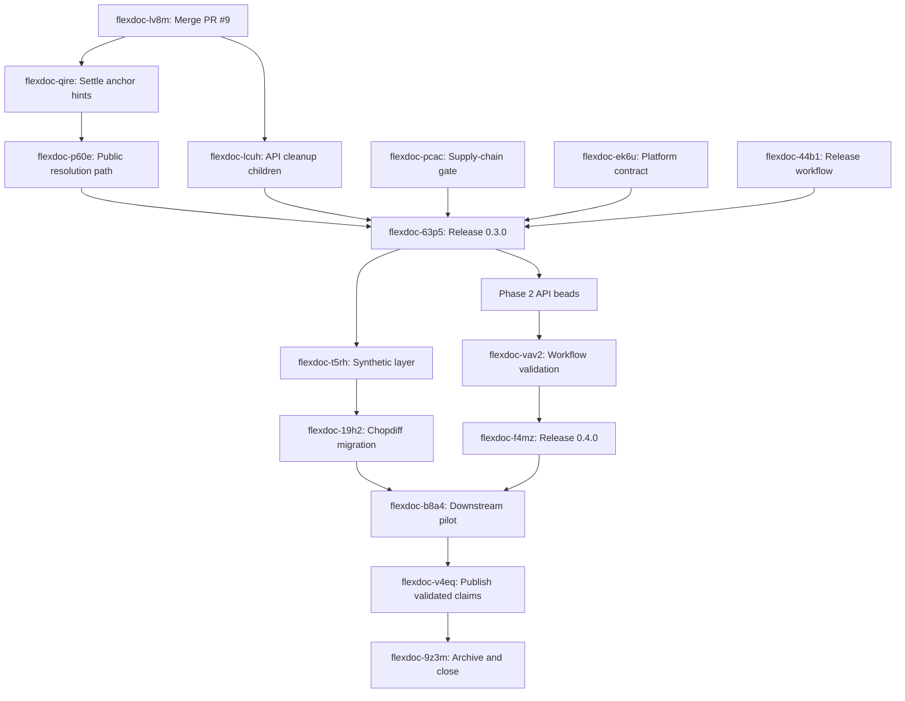

# Feature: Staged FlexDoc Stabilization and Promotion Roadmap

**Date:** 2026-07-09 (last updated 2026-07-09)

**Author:** Joshua Levy and Codex

**Status:** In progress; execution beads are mapped and maintainer decisions remain
open.

## Overview

This plan consolidates the implementation history, PR #9, the 2026-07 pre-promotion
review, and the follow-up engineering review into one staged roadmap.
It supersedes `plan-2026-07-08-post-review-refinements.md`, which remains as the initial
review snapshot.

The immediate objective is a coherent 0.3.0 boundary: ship the correctness changes
already on PR #9 together with the remaining pre-1.0 API decisions, refresh the
supply-chain state, and make the public contract internally consistent.
Later releases can add annotation and synthetic-layer mechanisms without reopening that
foundation.

## Goals

- Release the current breaking behavior changes and remaining pre-1.0 API decisions as
  one documented 0.3.0 boundary
- Preserve one normalized source string and one Unicode-code-point offset space across
  every projection
- Make anchoring failures visible, including context-free offset hints over duplicate
  quotes
- Add annotation, suggestion, chunking, and outline mechanisms with explicit ownership,
  conflict, and schema-version semantics
- Complete the synthetic layer and downstream Chopdiff adoption after the public API is
  stable
- Keep every stage linked to real `tbd` beads, tests, release notes, and maintained
  documentation

## Non-Goals

- Byte-exact CRLF preservation in `FlexDoc`; callers that need file-coordinate fidelity
  require a separate offset-mapping design
- Full fuzzy or edit-distance anchoring in `resolve()`; approximate recovery must remain
  opt-in and report match quality
- CRDT anchors, collaborative editing, renderer implementation, or a rich-text editor
  model
- New dependencies without the repository’s cool-off, lockfile review, audit, and human
  exception process
- Rewriting historical design records that are clearly labeled as implemented or
  superseded

## Background

PR #9 fixes CRLF span corruption, frontmatter leakage into the Markdown parse, ambiguous
exact-quote selection, empty overlap semantics, and HTML-attribute hardening.
The follow-up review also found and fixed a remaining double parse: documents with
frontmatter built links from a second body-only parse even though the blanked shared
parse was already safe to reuse.

The review also confirmed two planning gaps:

- An `Annotation` model alone does not define who owns annotations or how they enter a
  `DocGraph`; the builder currently receives only a `NodeTable`.
- A `SuggestedEdit` record alone does not define batch application, overlap conflicts,
  stale anchors, or atomic failure behavior.

The supply-chain cutoff and lockfile were refreshed on 2026-07-09. All expired package
exceptions and audit ignores are removed, and the unignored audit passes.

## Tracking

- `flexdoc-aqjg`: top-level execution epic for this specification
- `flexdoc-r634`: Phase 1, stabilize and release FlexDoc 0.3.0
- `flexdoc-6582`: Phase 2, add source-grounded workflow APIs and release 0.4.0
- `flexdoc-ww1i`: Phase 3, complete extensions, downstream adoption, and promotion
- `flexdoc-z09f`: optional fuzzy anchoring after the normalized matching corpus; not a
  0.4.0 release gate
- `flexdoc-le2a`: preparation of the execution graph in this document

The PR #9 follow-up review (`flexdoc-5bux`) is complete.
The broad AI-workflow placeholder (`flexdoc-86iy`) is superseded by the bounded Phase 2
beads below.

## Design

### Release Boundaries

- **0.3.0:** PR #9 behavior changes, anchoring contract decision, pre-1.0 API cleanup,
  and release/supply-chain gates
- **0.4.0:** additive annotation, suggestion, and structural-outline APIs plus the next
  `DocGraph` schema version
- **Later minor release:** synthetic layer and any associated cross-layer editing API

Do not publish the PR #9 changes as a 0.2.x patch.
CRLF normalization, ambiguous-quote resolution, and `TextUnit` string equality change
observable behavior and belong in the documented pre-1.0 minor release.

### Compatibility Requirements

- **Library APIs:** 0.3.0 may break APIs listed in Phase 1, with no compatibility
  aliases; every break needs a changelog migration note and root-surface contract test
- **Serialized formats:** preserve `DocGraph/v0.1`; introduce a new schema version when
  annotation fields become typed or populated
- **Source coordinates:** offsets index normalized `source_text`; external CRLF
  coordinates are unsupported unless a future mapping API is designed explicitly
- **Downstream Chopdiff:** coordinate export cleanup and the external-package rewire so
  it migrates once to the settled 0.3.0 surface

### Documentation Ownership

- `docs/flexdoc-spec.md` is the current behavioral contract
- This roadmap owns future sequencing and decisions
- Review documents record evidence and conclusions; they do not remain parallel task
  lists
- Implemented plans should move to the archive after their remaining deferred work is
  linked here or to a dedicated successor plan

## Implementation Plan

The graph separates work that can proceed in parallel from gates that require a released
contract. Every implementation bead includes focused tests, documentation, and an
explicit completion condition; testing is part of each change rather than a later
cleanup pass.

### Phase 1: Stabilize the 0.3.0 Contract and Release Gates

The merge baseline and three release-mechanics tasks can proceed in parallel.
The breaking API changes wait for PR #9 so their branches start from the normalized
source contract.

| Bead | Deliverable | Blocked By |
| --- | --- | --- |
| `flexdoc-lv8m` | Merge PR #9 and ratify normalized source coordinates | None |
| `flexdoc-qire` | Reject context-free hints over duplicate quotes; completed 2026-07-09 | `flexdoc-lv8m` |
| `flexdoc-lcuh` | Group the eight pre-1.0 API cleanup beads | `flexdoc-lv8m` establishes the baseline |
| `flexdoc-ltzx` | Make paragraph heading metadata properties; completed 2026-07-09 | `flexdoc-lv8m` |
| `flexdoc-ikm6` | Make recursive collection include inline descendants by default; completed 2026-07-09 | `flexdoc-lv8m` |
| `flexdoc-buw9` | Make cached structural views mutation-safe; completed 2026-07-09 | `flexdoc-lv8m` |
| `flexdoc-0cbm` | Rename the navigable-link form constant; completed 2026-07-09 | `flexdoc-lv8m` |
| `flexdoc-p60e` | Put resolution beside the public `SpanRef` API; completed 2026-07-09 | `flexdoc-qire` |
| `flexdoc-s85t` | Tier the `flexdoc.docs` export surface; completed 2026-07-09 | `flexdoc-lv8m` |
| `flexdoc-aaow` | Tolerate trailing horizontal whitespace on frontmatter delimiters; completed 2026-07-09 | `flexdoc-lv8m` |
| `flexdoc-uogy` | Share paragraph-size aggregation without a temporary `FlexDoc`; completed 2026-07-09 | `flexdoc-lv8m` |
| `flexdoc-pcac` | Refresh the supply-chain gate; completed 2026-07-09 with no exceptions or audit ignores | None |
| `flexdoc-ek6u` | Back the OS-independent classifier with representative macOS CI; completed 2026-07-09 | None |
| `flexdoc-44b1` | Harden and reproduce the tag-aware local release workflow; completed 2026-07-09 | None |
| `flexdoc-63p5` | Validate and publish 0.3.0 | Every preceding Phase 1 deliverable |

`TextUnit` is not in the API batch because its `StrEnum` conversion landed on PR #9. The
stale root-API beads `flexdoc-l0lc` and `flexdoc-bift` are also closed because their
implementation and contract tests already landed.

The structural cache decision is hybrid: `Block` graphs and their metadata are deeply
immutable and shared, while `sections()` recursively copies its tree because sections
contain deliberately editable `Paragraph` objects.
Both choices prevent public mutation from corrupting cached reads without freezing the
editing model.

### Phase 2: Add Source-Grounded AI Workflow Primitives

Phase 2 implementation begins after 0.3.0 publishes.
The annotation, anchoring, fragment, structure, and normalized-matching beads can then
proceed in parallel; suggestion batches require both the annotation schema and batch
resolution contract.

| Bead | Deliverable | Blocked By |
| --- | --- | --- |
| `flexdoc-jl5b` | Define annotation ownership and `DocGraph/v0.2` | `flexdoc-63p5` |
| `flexdoc-rbvu` | Add quote construction and batch `SpanRef` resolution | `flexdoc-63p5` |
| `flexdoc-p6xv` | Define rendered-text URL fragment projection | `flexdoc-63p5` |
| `flexdoc-hc17` | Add structural text accessors and section outlines | `flexdoc-63p5` |
| `flexdoc-i229` | Add opt-in normalized re-anchoring with corpus evidence | `flexdoc-63p5` |
| `flexdoc-zdu2` | Define `SuggestedEdit` and atomic batch application | `flexdoc-jl5b`, `flexdoc-rbvu` |
| `flexdoc-vav2` | Validate AI workflows with runnable examples and compatibility tests | All preceding Phase 2 API beads |
| `flexdoc-f4mz` | Validate and publish 0.4.0 | `flexdoc-vav2` |

`flexdoc-z09f` evaluates fuzzy or edit-distance recovery only after `flexdoc-i229` has a
representative corpus.
It remains opt-in backlog work and does not block 0.4.0.

### Phase 3: Complete Extensions, Downstream Adoption, and Promotion

The synthetic layer can begin after 0.3.0. Promotion waits for both the released 0.4.0
workflow APIs and the Chopdiff migration.

| Bead | Deliverable | Blocked By |
| --- | --- | --- |
| `flexdoc-t5rh` | Implement the synthetic marker-tag layer | `flexdoc-63p5` |
| `flexdoc-19h2` | Migrate Chopdiff once to the released surface | `flexdoc-t5rh` |
| `flexdoc-b8a4` | Exercise annotation and chunking APIs downstream | `flexdoc-19h2`, `flexdoc-f4mz` |
| `flexdoc-v4eq` | Publish the validated introduction and public claims | `flexdoc-b8a4` |
| `flexdoc-9z3m` | Archive superseded plans and close the roadmap | `flexdoc-v4eq` |

## Testing Strategy

- Follow red-green-refactor for each behavior change; keep the smallest regression that
  reproduces each failure
- Preserve the golden corpus as the broad behavioral view and keep independent
  invariants for spans, cover, tree relationships, and serialization
- Add contract tests for every root export, breaking migration, and `DocGraph` schema
  version
- Test anchoring against duplicate quotes, missing context, stale hints, edited context,
  and overlapping suggestion batches
- Run all supported Python versions in CI and one macOS job if the OS-independent claim
  remains
- Run `make lint`, `make test`, golden regeneration, wheel smoke, and `pip-audit` before
  every release

## Rollout Plan

1. Merge PR #9 after its branch tests and CI pass; do not publish it as 0.2.x.
2. Complete Phase 1 and publish 0.3.0 with a migration-focused changelog.
3. Complete Phase 2 behind the next `DocGraph` schema version and publish 0.4.0.
4. Complete Phase 3 only after downstream adoption validates the extension APIs.

## Open Questions

- Who owns annotations, and how are they supplied to `DocGraph` serialization?
- Does a populated annotation layer require `DocGraph/v0.2` on every graph or only on
  graphs that include annotations?

## References

- PR [#9](https://github.com/jlevy/flexdoc/pull/9)
- [2026-07 senior engineering review](../../review/senior-engineering-review-flexdoc-2026-07.md)
- [FlexDoc design specification](../../../flexdoc-spec.md)
- [Initial post-review refinements plan](plan-2026-07-08-post-review-refinements.md)
- [Extraction plan](plan-2026-06-11-flexdoc-extraction.md)
- [W3C Web Annotation selectors](https://www.w3.org/TR/annotation-model/#selectors)
- [URL Fragment Text Directives](https://wicg.github.io/scroll-to-text-fragment/)

<!-- This document follows common-doc-guidelines.md.
See github.com/jlevy/practical-prose and review guidelines before editing.
-->
